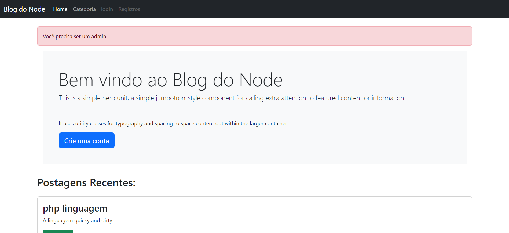

Este é um blog desenvolvido em Node.js que oferece uma solução completa para gerenciamento de conteúdo. O aplicativo conta com um sistema de autenticação de login, permitindo diferentes níveis de acesso para usuários e administradores.

Na visão de usuário, os visitantes podem acessar e interagir com o conteúdo do blog, enquanto a visão de administrador oferece ferramentas adicionais para a gestão do site. Os administradores têm a capacidade de adicionar novas categorias e postagens, o que facilita a organização e a atualização do conteúdo do blog.

Essa estrutura proporciona uma plataforma robusta para a criação e manutenção de blogs, garantindo tanto a segurança quanto a flexibilidade na administração do conteúdo.